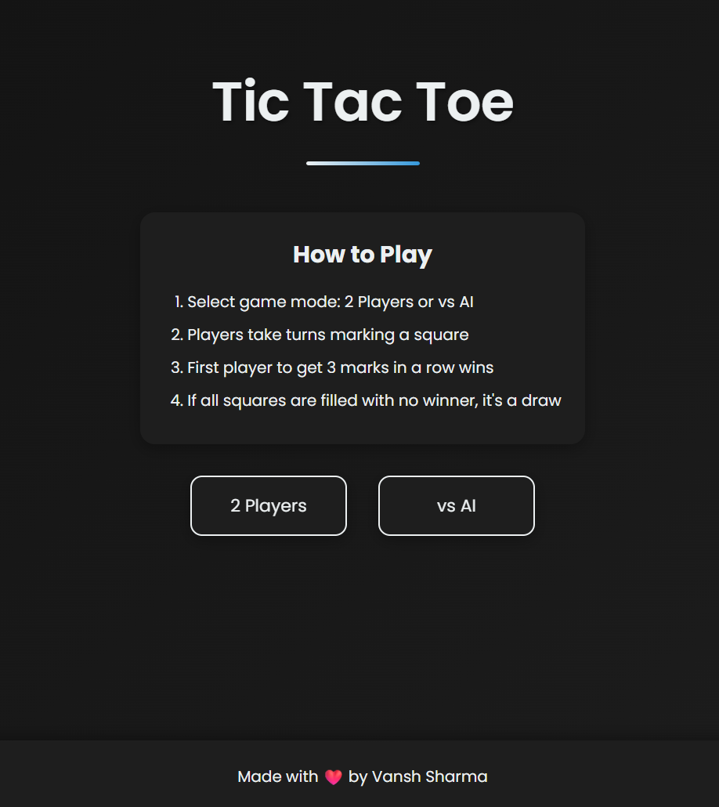
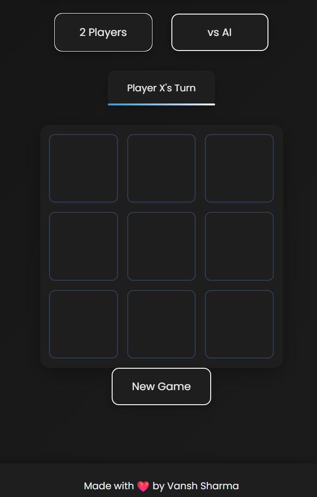

# Luxury Tic Tac Toe

A modern, responsive implementation of the classic Tic Tac Toe game with a sleek UI, dark/light theme, and multiple game modes.

## Features

- **Beautiful UI**: Clean, modern interface with smooth animations
- **Responsive Design**: Works perfectly on mobile, tablet, and desktop
- **Game Modes**: Play against a friend or challenge the AI
- **AI Difficulty Levels**: Easy, Medium, and Hard
- **Dark/Light Theme**: Toggle between themes with persistent preference
- **Winning Animations**: Celebrate victories with visual effects

## Screenshots

### Main Screen

### Gameplay

## How to Play

1. Select game mode: 2 Players or vs AI
2. If playing against AI, choose a difficulty level
3. Players take turns marking a square (X goes first)
4. First player to get 3 marks in a row (horizontally, vertically, or diagonally) wins
5. If all squares are filled with no winner, it's a draw

## Technologies Used

- HTML5
- CSS3 (with modern features like CSS variables, flexbox, grid)
- JavaScript (ES6+)
- Local Storage for theme persistence

## Developer

**Vansh Sharma (viktorexe)** - Full Stack Developer

- GitHub: [github.com/viktorexe](https://github.com/viktorexe)
- LinkedIn: [linkedin.com/in/vansh-sharma-293802355](https://linkedin.com/in/vansh-sharma-293802355)
- Portfolio: [vanshfolio.vercel.app](https://vanshfolio.vercel.app)
- Email: developer.viktorexe@gmail.com

## License

This project is open source and available under the [MIT License](LICENSE).